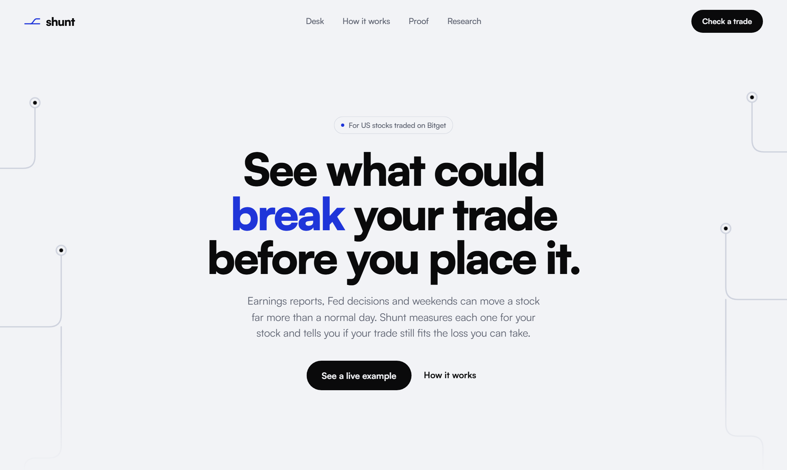
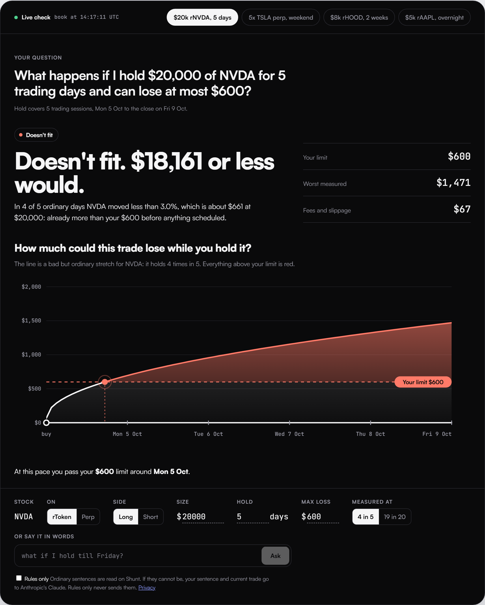
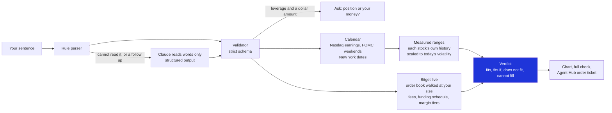
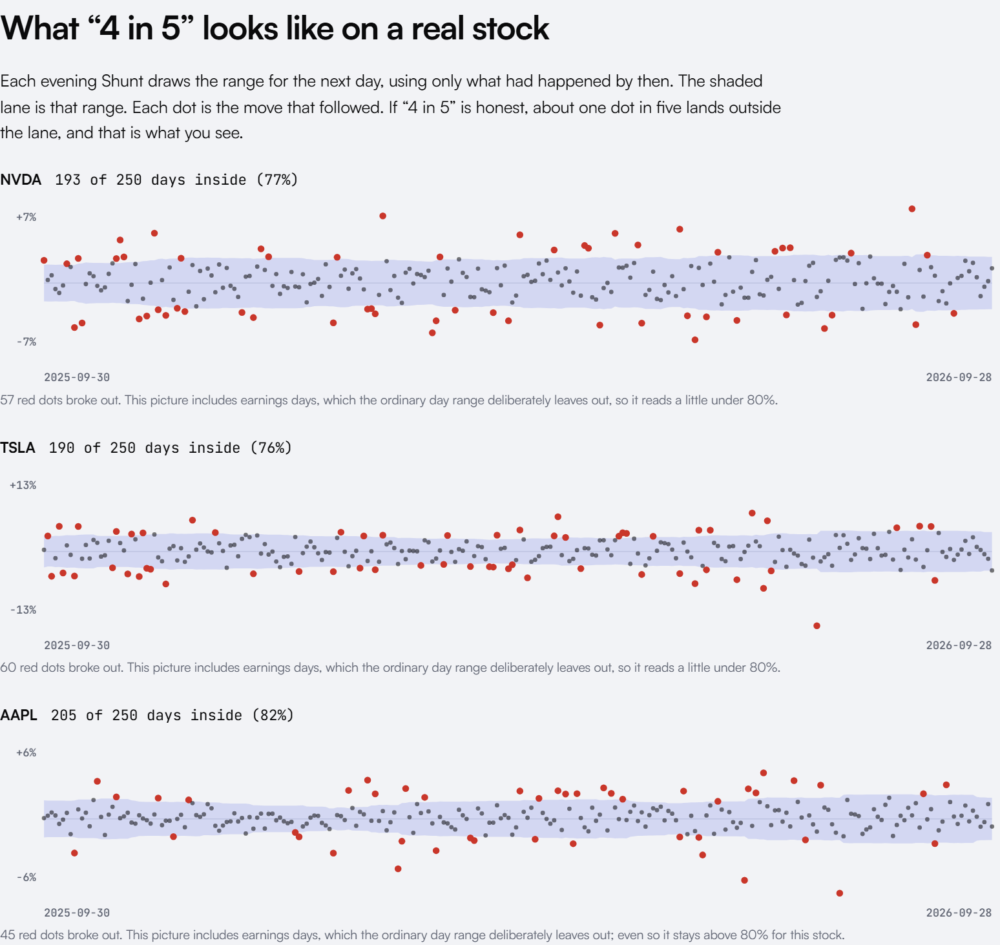

<p align="center">
  
</p>

<p align="center">
  <b>See what could break your trade before you place it.</b><br>
  Say your trade in plain words. Shunt finds every earnings report, Fed decision and weekend inside your hold, measures how
  big each one has been for that exact stock, and tells you whether the trade still fits the loss you can take, with live Bitget costs.
</p>

<p align="center">
  <a href="https://shunt-eight.vercel.app"><b>Live app</b></a> ·
  <a href="https://youtu.be/3WRGlZvOSGw"><b>Demo video</b></a> ·
  <a href="https://shunt-eight.vercel.app/proof"><b>Proof</b></a> ·
  <a href="https://shunt-eight.vercel.app/research"><b>Research</b></a> ·
  <a href="https://github.com/jenzylove/shunt/actions/workflows/ci.yml"></a>
  
  
</p>

<p align="center">
  
</p>

Built for the **Bitget AI Base Camp S2, Track 3 (AI Trading Desk)**: a personalised research workbench that stress tests one
trader's own decision. No sign up.

## Start here

| Want to | Go to |
| --- | --- |
| Watch it in under two minutes | [Demo video on YouTube](https://youtu.be/3WRGlZvOSGw) |
| Try it in ten seconds | [shunt-eight.vercel.app](https://shunt-eight.vercel.app): four live example trades, or type your own |
| See whether the numbers hold up | [/proof](https://shunt-eight.vercel.app/proof): calibration on unseen history, a live journal, 118 Bitget Demo orders through Agent Hub, a 24 sentence answer key |
| See what failed before this | [/research](https://shunt-eight.vercel.app/research): two ideas that failed their tests, and the limits |
| Read the plan and the story | [docs/PRD.md](docs/PRD.md), [docs/BUILD_LOG.md](docs/BUILD_LOG.md) |
| Check the data | [docs/DATA_MANIFEST.json](docs/DATA_MANIFEST.json), [scripts/](scripts) |
| Submission copy | [docs/SUBMISSION_TEXT.md](docs/SUBMISSION_TEXT.md), [docs/SUBMISSION_CHECKLIST.md](docs/SUBMISSION_CHECKLIST.md) |

## The problem

A trader types "buy $20k of rNVDA, hold five days, I can lose $600". They checked the price. They did not check the calendar.
Inside those five days there may be the stock's own earnings, a bigger company's report it tends to move with, a Fed
decision, or a weekend with Wall Street shut. A stock's own earnings day moves about 4.7 times an ordinary day (1,497 stocks,
2016 to 2026), so a position sized for normal days is not sized for that one.

Shunt answers one question: **does my trade, at my size, survive what is scheduled while I hold it, within my own limit?**
It measures. It does not predict direction, and you decide.

## One check

<p align="center">
  
</p>

$20,000 of NVDA for five trading days with a $600 limit. In 4 of 5 ordinary days NVDA moved less than 3.0%, about $661 at that
size, so the trade is past the limit before anything scheduled. Shunt says so, gives the largest size that fits ($18,161 at the
time of this screenshot), and draws where the loss crosses the line. The full check lists every scheduled event with its own
measured move, the live Bitget costs, and an Agent Hub order ticket sized to fit.

## How it works



- **Words.** A rule parser reads ordinary sentences on the server. Only when it cannot, or for a follow up such as "what if I
  hold till Friday", Claude (`claude-opus-5-5`) turns the words into a trade through a closed schema. Claude never produces a
  number the user sees, and a "Rules only" switch keeps the sentence off the model entirely.
- **Ranges.** Every range is the size a stock stayed within 4 times in 5 (or 19 in 20) on past events of that kind, scaled to
  its volatility now. Events on the same day are added, a cautious upper bound, and flagged.
- **Costs.** Your size is walked through the live Bitget book both ways. Your loss limit covers the market move plus fees and
  slippage in and out, plus perp funding over the settlements Bitget will actually charge (a credit is never counted). The
  largest size that fits is found by re-pricing the book at each candidate size.
- **Honesty rules.** A thin book gives "can't fill", never a cost of zero. A missing source is named, never filled in. The
  liquidation distance is a labelled estimate and is hidden when Bitget's margin tiers cannot be read.

## Evidence

<p align="center">
  
</p>

| Check | Result |
| --- | --- |
| Ranges built only from earlier data, on unseen days | ordinary days 80.5%, overnight gaps 80.0%, own earnings 80.7%, Fed statement days 83.4%; weekends fall short at 70.6% and the page says so |
| Bitget Demo through Agent Hub (`bgc --paper-trading`) | 113 trades tried, 57 round trips (118 orders) on 8 stocks; median cost predicted 15.7 bps, charged 16.8 bps; every failure listed by reason |
| Answer key, 24 sentences | first run 14 of 24 with rules alone, 22 of 24 with Claude; misses fixed and published; 24 of 24 now |
| Forward journal | 30 ranges locked before each session, graded after it, never edited; first graded session: 28 of 30 inside |
| Tests | 65 unit and API tests in CI, including every regression case from an external audit |

Demo fills are simulated matching, so the orders test the fee and order book arithmetic, not live liquidity.

## Run it

```bash
npm install
cp .env.example .env.local   # optional ANTHROPIC_API_KEY; without it the rule parser still works
npm run dev                  # http://localhost:3000
npm test
```

Node 20 or newer. Data scripts live in `scripts/`: `build_dataset.py` (profiles for 2,218 stocks), `journal.mts` (the daily
forward journal, run by a GitHub Action), `proof-batch.mts` (the Demo orders), `answer-key.mts`, `manifest.py`.

## Limits

Shunt measures how big moves have been, not which way the next one goes. US CPI days are not included. Weekend ranges are
too narrow. Costs are a live snapshot. The full list is on [/research](https://shunt-eight.vercel.app/research#limits).
Security notes are in [SECURITY.md](SECURITY.md). MIT licensed.
